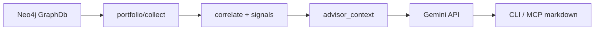

# Portfolio Layer for Multi-Repo Asset Management

Implementation spec. Usage guide: [docs/agent-skills/portfolio.md](../agent-skills/portfolio.md).

## Implemented components

| Component | Path |
|-----------|------|
| Graph queries | `src/db/graph/query_portfolio.rs` |
| Portfolio module | `src/portfolio/` |
| CLI | `knot portfolio` |
| MCP | `list_portfolio` |
| Gemini client | `src/portfolio/gemini.rs` |

## Configuration

```bash
# ~/.config/knot/.env — never commit
KNOT_GEMINI_API_KEY=your_key_here
KNOT_GEMINI_MODEL=gemini-3.6-flash
```

## CLI

```bash
knot portfolio --output markdown
knot portfolio --filter synth --no-ai
knot portfolio --horizon 24m --team-size 5 --focus "healthcare SaaS"
```

## Advisor output sections

When `KNOT_GEMINI_API_KEY` is set, Gemini returns seven structured sections parsed into `AdvisorSections`:

1. Organizational Asset Inventory
2. Resource Planning and Prioritization
3. Strategic Forecast
4. Recommended Actions
5. Real-World Benchmarks
6. Overall Portfolio Recommendation
7. Business Potential by Repository

Deterministic pre-Gemini insights (`src/portfolio/insights.rs`) enrich the prompt with maturity tiers, domain clusters, and stack overlap.

## Architecture


